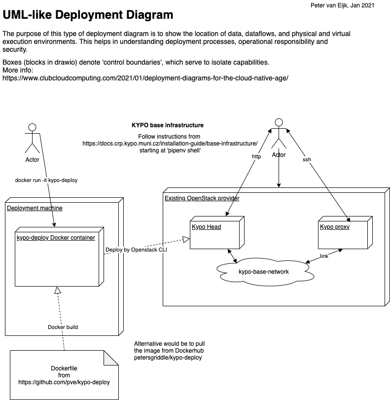

# kypo-deploy
Dockerfile for machine to deploy Kypo Base Infrastructure.
You will shell into the container, most easily done by
`docker run -it petersgriddle/kypo-deploy`
then pick up the instructions 
from https://docs.crp.kypo.muni.cz/installation-guide/base-infrastructure/ after `pipenv install`, 

My blogpost on https://www.clubcloudcomputing.com/2021/01/deployment-diagrams-for-the-cloud-native-age/
for an explanation of the diagram notation.

